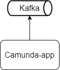
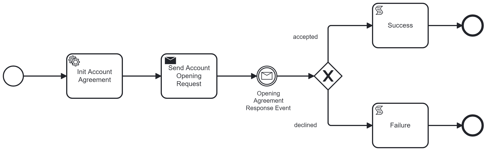

# Brokerage Account Opening Camunda app

## About
Business process for opening brokerage account in some brokerage provider 

## Environment
* Windows 10
* Java 20
* Gradle 8.2
* Docker 20.10.17
* docker-compose 1.29.2

## Architecture
### Components

### Business process

## Start
All commands should be executed from the root project folder

```console
cd docker

docker-compose up
```

```console
gradlew.bat clean build bootRun
```

## Usage
Camunda Web UI will start at http://localhost:8080/api/bpm/camunda/app/welcome/default/#!/login
* login: admin
* password: admin

### Start the process
POST localhost:8080/api/bpm/account/opening
```console
{
    "tariffId": "my-tariff-id",
    "correlationId": "my-correlation-id"
}
```

Curl:
```console
curl --location "localhost:8080/api/bpm/account/opening" --header "Content-Type: application/json" --data "{\"tariffId\": \"my-tariff-id\", \"correlationId\": \"my-correlation-id\"}"
```

### Emulate brokerage provider response message
```console
cd docker\confirmation

.\send.bat
```